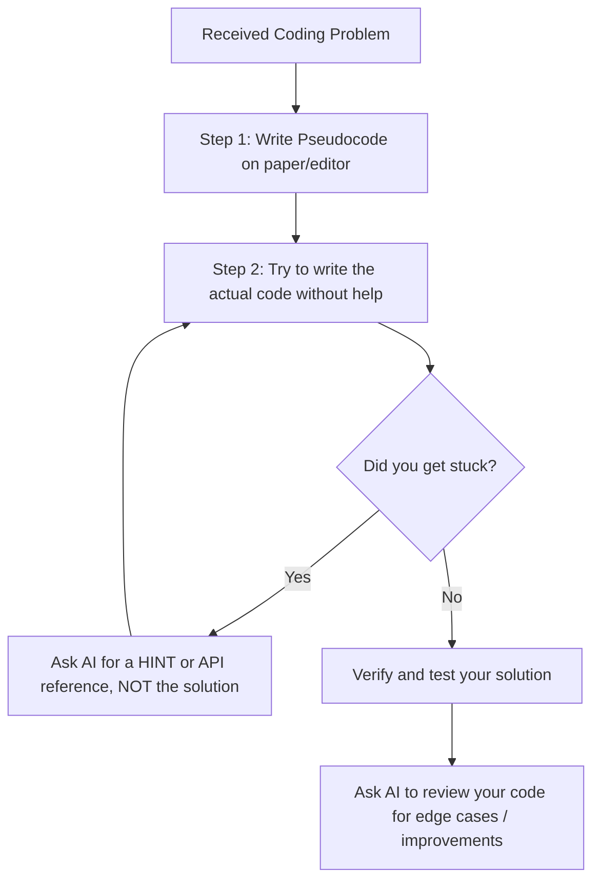

# Coding Skills Strategy: Rebuilding the "No-AI" Coding Muscle

This strategy document outlines how to prepare for job interviews that forbid AI tools, how to rebuild your raw coding problem-solving skills, and a structured set of practice exercises.

---

## 1. The Interview Reality: Why and What They Test

Companies test coding without AI not to see if you have memorized every library method, but to evaluate **how you think** when you don't have a safety net. 

### What Interviewers Look For
1. **Problem Translation**: Can you take a vague requirement and translate it into logic, steps, or pseudocode?
2. **Core Fundamentals**: Do you understand arrays, objects, loops, recursion, and basic time/space complexity (Big O)?
3. **Edge Case Handling**: Can you spot bugs or potential failures (e.g., null values, empty arrays, division by zero) before running the code?
4. **Communication**: Can you explain *why* you chose a map over a list, or *how* your loop works?

### The Target Proficiency Level
You do **not** need to write flawless code on the first try. You *do* need to be able to:
- Write syntactically valid core Javascript/TypeScript (e.g., array map/filter/reduce, promises, async/await, basic classes or closures).
- Explain the logic flow clearly.
- Debug your own code when the interviewer gives you a failing input.

---

## 2. The Strategy: How to Train with AI (Not Rely on It)

To stop your skills from fading, you must change your relationship with AI from **"Generator"** to **"Tutor"**.

### The Rules of the "Developer Gym"
1. **No Copy-Paste**: When practicing, you must type every single line manually. This builds muscle memory.
2. **The 15-Minute Rule**: Spend at least 15 minutes struggling with a bug or logic error on your own before looking up the solution or asking an AI.
3. **Use the "Hint-Only" Prompt**: When asking an AI for help, start your query with: 
   > *"I am practicing coding without AI. Do not write any code for me. Give me a conceptual hint on how to solve [X] or tell me what syntax error I made on line [Y]."*

---

## 3. The Rebuilding Exercises (Next.js & JavaScript/TypeScript Focus)

Since your active workspace is **NextPrismaStudio**, the drills below are tailored to core JavaScript, React/Next.js concepts, and database mapping (Prisma), which are highly relevant to your stack.

| Level | Focus Area | Exercise Goal | Expected Time |
| :--- | :--- | :--- | :--- |
| **Level 1** | Pure JS Fundamentals | Implement custom array methods (map, filter, reduce) from scratch. | 20 mins |
| **Level 2** | Asynchronous Logic | Write a rate-limiter or batch execution scheduler for promises. | 35 mins |
| **Level 3** | React State & Hooks | Build a custom React hook `useDebounce` and `useLocalStorage`. | 30 mins |
| **Level 4** | Data Schema & Joins | Write raw SQL/JS to group relational data without an ORM. | 45 mins |

---

## 4. Let's Start: Live Interview Drills

Here is how we can practice together. We will run mock exercises. 
* I will give you a problem statement.
* You will write the code directly in your editor (or a temporary scratch file).
* You will not use AI or search engines.
* When you are done (or stuck), paste your code in our chat, and we will review it together.

> [!TIP]
> Treat these exercises like a real interview. Write comments explaining your thought process as you code.
